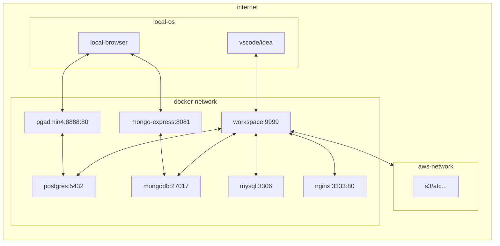

# My Workspace Docker Environment

This repository contains a Docker-based development environment setup for various programming languages and tools.

## Directory Structure
```
vscode@8d0d24b7b8fd:~/workspace$ tree -adI '.git|.docker'
.
├── .devcontainer
│   └── docker
│       ├── keycloak
│       ├── mysql
│       ├── nginx
│       │   └── conf.d
│       ├── postgres
│       └── workspace
│           └── git
│               └── .githooks
├── .github
│   └── workflows
├── .idea
├── .vscode
│   └── snippets
└── temp

16 directories
```

## Prerequisites

- Mac
- Docker
- Docker Compose
- Editor/IDE
  - Visual Studio Code
    - [Remote - Containers](https://marketplace.visualstudio.com/items?itemName=ms-vscode-remote.remote-containers) extension for Visual Studio Code
  - IntelliJ IDEA

## Setup

1. Clone this repository.
2. Copy `.env.example` to `.env` and modify the environment variables as needed.
3. Open this repository in Visual Studio Code.
4. Press `Command+Shift+P` to open the command palette.
5. Type `Reopen in Container` and press `Enter`. This will reopen the workspace inside the Docker container.

>[!NOTE] 
>[For IntelliJ IDEA](https://pleiades.io/help/idea/connect-to-devcontainer.html#create_dev_container_inside_ide)

## Services

The Docker environment includes the following services:

- Workspace: A development environment with various programming languages and tools installed.
- PostgreSQL: A PostgreSQL database server.
- PgAdmin: A web-based PostgreSQL database client.
- MySQL: A MySQL database server.
- MongoDB: A MongoDB database server.
- Mongo Express: A web-based MongoDB database client.
- ~~keycloak: authentication/authorization server.~~
- atc...

## Development Environment

The workspace service includes the following programming languages and tools:

- Java (via SDKMAN)
- Gradle (via SDKMAN)
- Maven (via SDKMAN)
- Kotlin (via SDKMAN)
- Python (via pyenv)
- Node.js (via nvm)
- Docker (via host os)
- AWS CDK (via npm)
- ~~Go (via gvm)~~
- GCC and G++ (latest versions)
- AWS CLI
- GitHub CLI
- AWS SAM CLI
- atc...

## network diagram



